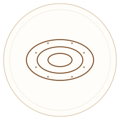

# Maison du Cuivre — Site web

Site vitrine statique (HTML / CSS / JS, sans backend) pour l'entreprise artisanale **Maison du Cuivre**.

## Structure du site

- `index.html` — Accueil
- `apropos.html` — À propos
- `galerie.html` — Galerie & Produits (avec filtres par catégorie)
- `sur-mesure.html` — Sur mesure (processus + formulaire de devis)
- `contact.html` — Contact & Localisation (formulaire, coordonnées, carte Rue de Gammarth)
- `css/style.css` — Feuille de style unique
- `js/main.js` — Menu mobile, filtres galerie, formulaires, animations au scroll
- `images/products/*.svg` — Illustrations produits (à remplacer, voir ci-dessous)

Aucune dépendance externe (pas de CDN, pas de police Google Fonts) : le site fonctionne hors-ligne et se déploie tel quel sur n'importe quel hébergement statique.

## ⚠️ À faire avant la mise en ligne

### 1. Remplacer les visuels par vos vraies photos

Je n'ai pas pu accéder à votre page Facebook depuis cet environnement (accès réseau restreint), donc les visuels produits sont actuellement des **icônes SVG illustratives** (couleur cuivre), et non de vraies photos.

Pour les remplacer :
1. Téléchargez vos photos depuis votre page Facebook : https://www.facebook.com/profile.php?id=61577043486522
2. Renommez-les ou placez-les dans `images/products/` (par ex. `plateau.jpg`)
3. Dans chaque page HTML, remplacez le `src` correspondant, par exemple :
   ```html
   
   ```
   devient :
   ```html
   
   ```
4. Faites de même pour l'image de la section "Notre maison" (accueil) et "Qui sommes-nous" (à propos), idéalement avec une photo de l'atelier ou de l'équipe.

### 2. Mettre à jour les avis clients

Les avis affichés sur la page d'accueil (section « Avis clients ») sont des **exemples**. Remplacez-les par vos véritables avis Facebook :
- Copiez le texte de l'avis, le nom du client et la note (étoiles) depuis l'onglet « Avis » de votre page Facebook
- Modifiez le bloc `.testimonial-card` correspondant dans `index.html`

### 3. Compléter les coordonnées

Remplacez les valeurs suivantes (présentes dans le footer de chaque page et sur `contact.html`) :
- Téléphone : `+216 XX XXX XXX`
- E-mail : `contact@maisonducuivre.tn`
- Adresse précise si vous souhaitez un point plus exact que « Rue de Gammarth » sur la carte (fichier `contact.html`, section carte)

### 4. Connecter les formulaires

Les formulaires (page Sur mesure et Contact) sont des **démonstrations front-end** : ils affichent un message de confirmation mais n'envoient rien nulle part. Pour recevoir réellement les messages par e-mail, deux options simples sans backend :
- [Formspree](https://formspree.io/) — ajoutez `action="https://formspree.io/f/VOTRE_ID"` et `method="POST"` sur la balise `<form>`
- [EmailJS](https://www.emailjs.com/) — envoi via JavaScript directement depuis le formulaire

## Déploiement

Ce site est 100% statique, il peut être déployé gratuitement sur :
- **Netlify** ou **Vercel** (glisser-déposer le dossier, ou lier le dépôt Git)
- **GitHub Pages**
- Tout hébergement mutuel classique (envoi par FTP)

## Aperçu local

Ouvrez simplement `index.html` dans un navigateur, ou lancez un petit serveur local :

```bash
python3 -m http.server 8000
```

puis rendez-vous sur `http://localhost:8000`.
